# กระบวนการจัดซื้อจัดจ้าง (ส่วนเพิ่ม)

กระบวนการเพิ่มเติม สำหรับกรณีจัดซื้อจัดจ้างแยกหัวข้อเป็นเรื่องๆ ดังนี้

* กรณีเงินงวด (Invoice Plan Installment)
* การสร้างเอกสารตรวจรับ (WA) กรณีมีเงินงวด (Invoice Plan)
* หลักประกันซอง (TE Guarantee กรณี e-Bidding)
* หลักประกันสัญญา (RFQ Guarantee)
* เงินประกันผลงาน (Retention)
* กรณีเงินงวดแบบมีเงินมัดจำ (Invoice Plan + 1st Deposit)

**เอกสารนี้สำหรับ ::** เจ้าหน้าที่พัสดุ (Procurement Officer)

----------------------------------------------------------

## กรณีเงินงวด (Invoice Plan Installment)

เงินงวดหมายถึงการวางแผนการซื้อโดยแบ่งจ่ายเป็นงวดๆ ระบบจะใช้ตาราง Invoice Plan ในการเก็บสัดส่วนการจ่ายในแต่ละงวด

**Menu ::** Purchase > Orders > Requests for Quotation

!!! Note
      - การบันทึกเงินงวด จะบันทึกที่ RFQ ใบเสนอราคาจากผู้ขาย/ผู้ให้บริการที่ได้รับการคัดเลือกสถานะ Draft
      - Ref: [สร้างใบเสนอราคา RFQ (จาก Purchase Agreement/TE)](po3_for_procurement_officer.md#rfq-purchase-agreementte)

1. สร้าง Invoice Plan
      1. กดปุ่มเพื่อ Edit RFQ, และเลือก Use Invoice Plan เพื่อเปิดการใช้งาน Invoice Plan
      2. คลิกลิงค์ Create Invoice Plan เพื่อเปิด Wizard
      3. Number of installment: เลือกจำนวนงวดการแบ่งจ่ายที่ต้องการ
      4. Installment Date: เลือกวันที่การจ่ายงวดแรก
      5. Interval: เลือกช่วงเวลาระหว่างงวด (เป็นแค่ตัวช่วย)
      6. กดปุ่ม Create Invoice Plan เพื่อสร้างตารางการแบ่งจ่าย
            

2. ปรับรายละเอียดตาราง Invoice Plan
      1. Installment: แสดงงวดการจ่าย
      2. Type: ประเภท (Installment/Deposit)
      3. Percent, Amount: จำนวนเงินในแต่ละงวด
            

    !!! Note
          - สามารถแก้ไข เพิ่ม/ลด ตารางได้ตามต้องการในสถานะเอกสาร Draft
          - แต่ยอดรวม % ต้องเท่ากับ 100 เสมอ

End.

----------------------------------------------------------

## การสร้างเอกสารตรวจรับ WA กรณีใช้ Invoice Plan

**Menu ::** Purchase > Orders > Purchase Orders

!!! Note
      - ขั้นตอนนี้สำหรับ Purchase Order ที่อนุมัติแล้ว (Approved) และมีการใช้ Invoice Plan
      - การตรวจรับ WA จะถูกบังคับสร้างตามงวดที่วางไว้ที่ Invoice Plan (Create WA by Installment)

1. จาก Purchase Order ทำการสร้างเอกสารตรวจรับ WA
      1. กดปุ่ม Create WA by Installment ระบบจะเปิด Wizard
      2. เลือกงวด Installment ที่ต้องการสร้าง WA
            
      3. กดปุ่ม Create WA ระบบจะพาไปยังเอกสาร WA ที่สร้างขึ้น
      4. จะเห็นว่า Quantity บน WA จะเป็นไปตามสัดส่วนของ Installment ที่เลือกโดยอัตโนมัติ
            

2. ทำการอนุมัติ / ประเมิน / ค่าปรับ เอกสาร WA นี้ตามปกติ

    !!! Note
          - เอกสาร WA ที่อนุมัติแล้ว จะถูกใช้ในการควบคุมการรับวัสดุ และการสร้างใบแจ้งหนี้ตามปกติต่อไป

End.

----------------------------------------------------------

## หลักประกันซอง (TE Guarantee กรณี e-Bidding)

**Menu ::** Purchase > Orders > Purchase Agreements

!!! Note
      - กรณี e-Bidding จะมีการวางหลักประกันซองของทุกผู้ที่ยื่นซองประกวดราคา
      - เจ้าหน้าที่พัสดุบันทึกหลักประกันซองที่ TE (ข้อ 1)
      - การบันทึกหลักประกันซองและการคืนหลักประกันเมื่อประกาศผลการประกวดราคา ดำเนินการโดยการเงินบัญชี

1. ที่ TE สร้าง Guarantee ประเภท หลักประกันซอง
      1. กดปุ่ม "Guarantee"
      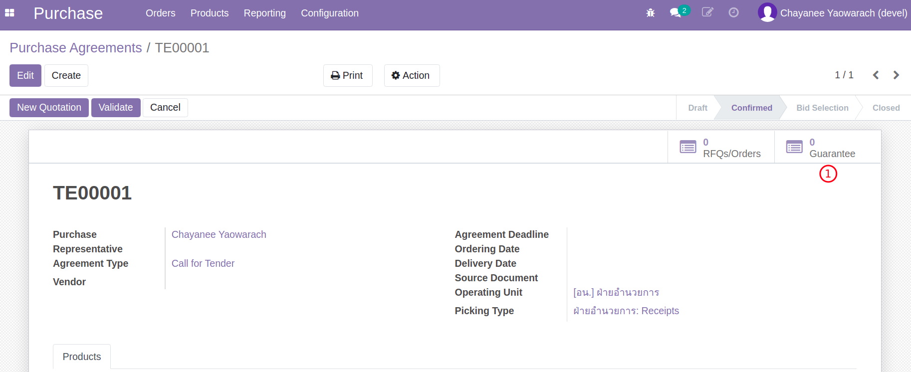
      2. กดปุ่ม Create เพื่อสร้าง Guarantee สำหรับ TE นี้
      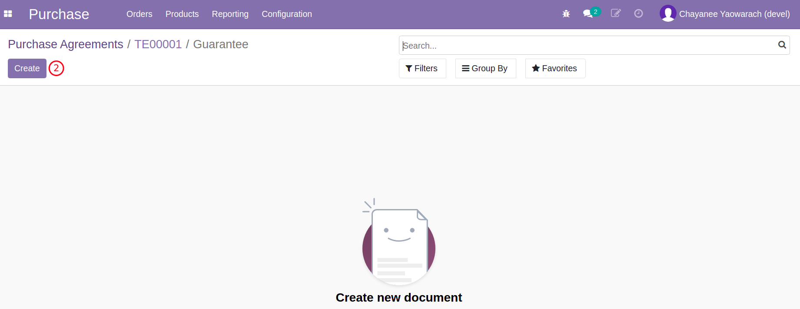
      3. กรอกรายละเอียดของ Guarantee
      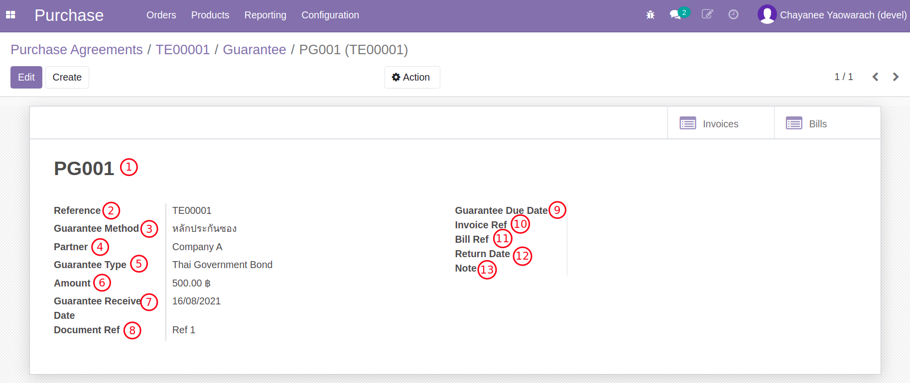
            1. Guarantee Number: หมายเลขอ้างอิงของหลักประกัน (ใช้ในการสื่อสารกับฝ่ายบัญชี) 
            2. Reference: เลขที่เอกสารต้นทาง 
            3. Guarantee Method: อ้างอิงหลักประกัน ในที่นี้จะเป็นหลักประกันซอง 
            4. Partner: ชื่อผู้เสนอราคา 
            5. Guarantee Type: ประเภทของหลักประกัน เช่น เช็ค พันธบัตรรัฐบาลไทย 
            6. Amount: เงินสำหรับหลักประกัน 
            7. Guarantee Receive Date: วันที่ได้รับหลักประกัน 
            8. Document Ref: อ้างอิงเอกสารหลักประกัน 
            9. Guarantee Due Date: วันที่ครบกำหนดคืนหลักประกัน 
            10. Invoice Ref: อ้างอิงเลขที่ Customer Invoice 
            11. Bill Ref: อ้างอิงเลขที่ Vendor Bill 
            12. Return Date: วันที่คืนหลักประกัน 
            13. Note: บันทึกรายละเอียดเพิ่มเติมสำหรับหลักประกัน 

!!! Note
      - ในตัวอย่างนี้ไม่ต้องให้ฝ่ายบัญชีดำเนินการเรียกเก็บหลักประกัน เพราะเป็นประเภท Thai Government Bond (แต่ต้องอ้างถึงที่ฟิลด์ Document Ref)
      - สรุป Guarantee Type ที่ต้องมีการเรียกเก็บเงิน (Create Invoice ?)
      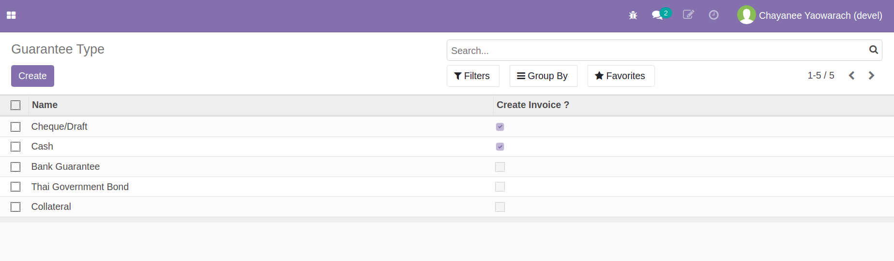

End.

----------------------------------------------------------

## หลักประกันสัญญา (Guarantee ที่ PO)

**Menu ::** Purchase > Orders > Purchase Orders

1. จาก RFQ ที่ได้รับคัดเลือก และผ่านการอนุมัติจากผู้อนุมัติ (Status เปลี่ยนเป็น PO) ให้สร้าง Guarantee ประเภทหลักประกันสัญญา
      1. กดปุ่ม "Guarantee"
      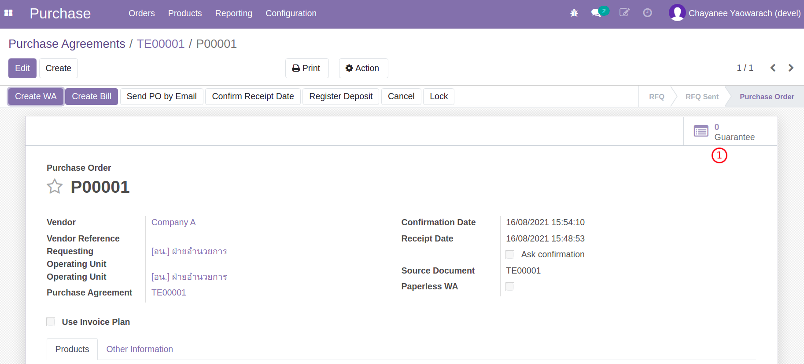
      2. กดปุ่ม Create เพื่อสร้าง Guarantee สำหรับ PO นี้
      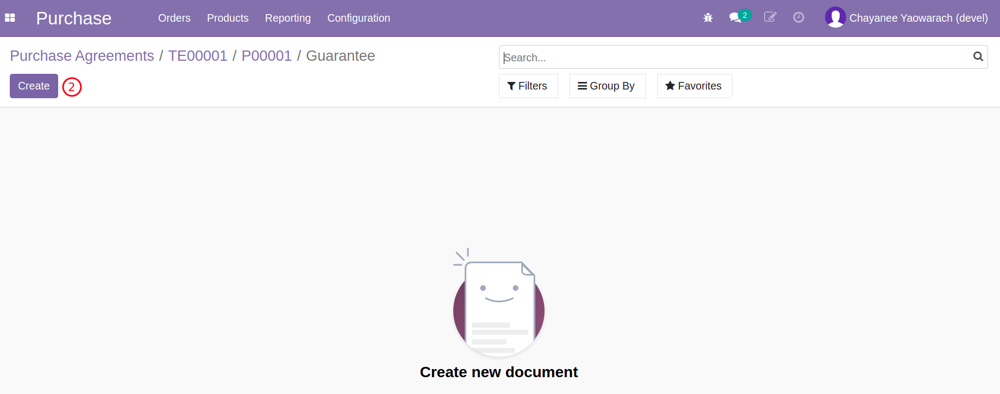
      3. กรอกรายละเอียดของ Guarantee
      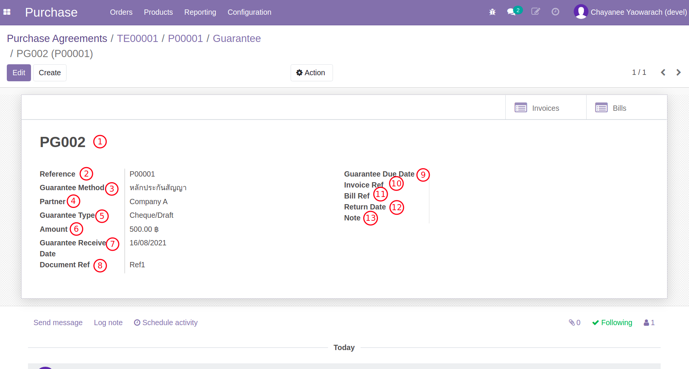
            1. Guarantee Number: หมายเลขอ้างอิงของหลักประกัน (ใช้ในการสื่อสารกับฝ่ายบัญชี) 
            2. Reference: เลขที่เอกสารต้นทาง 
            3. Guarantee Method: อ้างอิงหลักประกัน ในที่นี้จะเป็นหลักประกันสัญญา 
            4. Partner: ชื่อผู้เสนอราคา 
            5. Guarantee Type: ประเภทของหลักประกัน เช่น เช็ค พันธบัตรรัฐบาลไทย 
            6. Amount: เงินสำหรับหลักประกัน 
            7. Guarantee Receive Date: วันที่ได้รับหลักประกัน 
            8. Document Ref: อ้างอิงเอกสารหลักประกัน 
            9. Guarantee Due Date: วันที่ครบกำหนดคืนหลักประกัน 
            10. Invoice Ref: อ้างอิงเลขที่ Customer Invoice 
            11. Bill Ref: อ้างอิงเลขที่ Vendor Bill 
            12. Return Date: วันที่คืนหลักประกัน 
            13. Note: บันทึกรายละเอียดเพิ่มเติมสำหรับหลักประกัน 

2. การเงินบัญชีบันทึกหลักประกันสัญญา (Customer Invoice -> Payment)
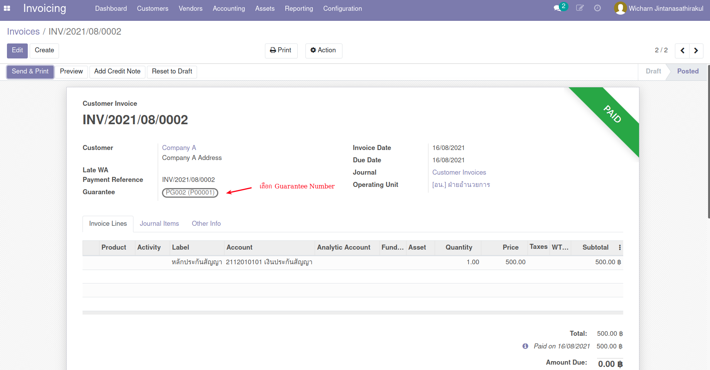
3. เมื่อถึงกำหนดการคืนหลักประกัน การเงินบัญชีดำเนินการคืนหลักประกัน (Vendor Bill -> Payment)
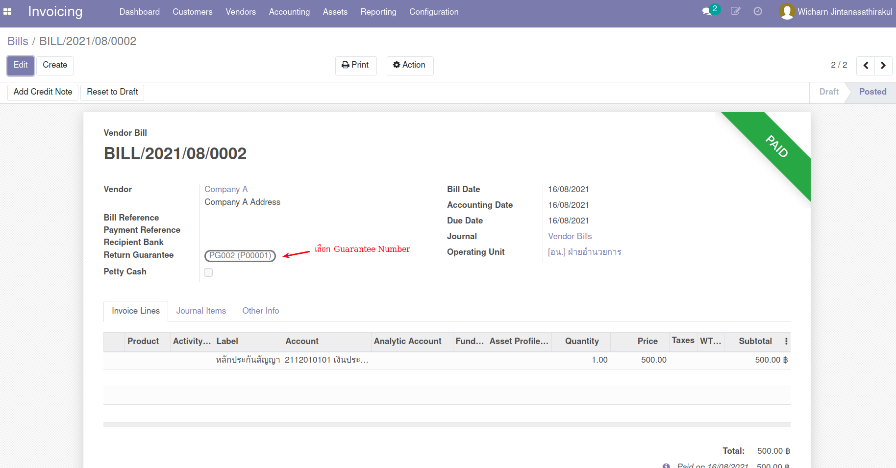
4. เอกสารหลักประกันทั้งหมด สามารถเรียกดูได้ที่เมนู Purchase > Orders > Guarantee

End.

----------------------------------------------------------

## เงินประกันผลงาน (Retention)

**Menu ::** Purchase > Orders > Requests for Quotation

!!! Note
      - เงินประกันผลงาน คือ การหักเงินประกันจากเงินงวดในอัตราร้อยละหรือจำนวนเงินที่เท่าๆ กัน ทุกงวด
      - บันทึกอัตราร้อยละหรือจำนวนเงินประกันผลงาน ที่ Invoice Plan เท่านั้น
      - เจ้าหน้าที่พัสดุกำหนดอัตราร้อยละหรือจำนวนเงินประกันผลงาน (ข้อ 1) แต่การหักเงินประกันผลงานจะถูกบันทึกโดยฝ่ายบัญชีตอนจ่ายชำระเงินงวดแก่ผู้ขาย/ผู้ให้บริการ

1. กำหนดอัตราการหักเงินแต่ละงวด เป็นอัตราร้อยละหรือจำนวนเงิน เพื่อการประกันผลงาน
      

       

2. ดำเนินการอนุมัติ RFQ ไปจนถึงการตรวจรับวัสดุ WA ในแต่ละงวดตามกระบวนการปกติ
3. เมื่อถึงขั้นตอนการออกใบแจ้งหนี้ให้กดปุ่ม Create Bill เลือก WA เพื่อสร้าง Invoice ตามปกติ
4. ดูเอกสาร Vendor Bills ที่สร้างขึ้น
      1. ระบบจะสร้างเอกสารใบแจ้งหนี้ให้ ซึ่งเมื่อคลิกที่ปุ่ม "Vendor Bills" ระบบจะแสดงใบแจ้งหนี้ที่ถูกสร้างตาม WA และ Invoice Plan
      
      2. คลิกเข้าไปดูในแต่ละเอกสารที่สร้างขึ้นจะเห็นว่า มีการหักเงินประกันผลงานไว้ในแต่ละใบแจ้งหนี้
      
      

End.

----------------------------------------------------------

## กรณีคืนเงินประกันผลงาน และต้องวางหลักประกัน

**Menu ::** Purchase > Orders > Purchase Orders

1. เจ้าหน้าที่บัญชีคืนเงินประกันผลงานที่ Vendor Bills
2. เจ้าหน้าที่พัสดุบันทึกหลักประกันผลงาน
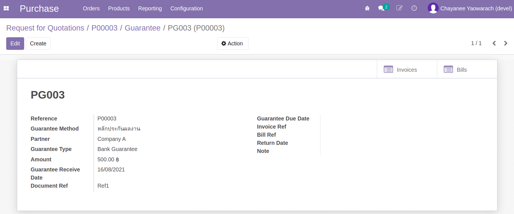
3. หลังจากหมดภาระผูกพัน เจ้าหน้าที่พัสดุบันทึกข้อมูลการคืนหลักประกันผลงาน

----------------------------------------------------------

## กรณีเงินงวดแบบมีเงินมัดจำ (Invoice Plan + Deposit)

**Menu ::** Purchase > Orders > Requests for Quotation

!!! Note
      - การบันทึกเงินงวด + เงินมัดจำบน Invoice Plan จะบันทึกที่ RFQ 
      - Ref: [สร้างใบเสนอราคา RFQ (จาก Purchase Agreement/TE)](po3_for_procurement_officer.md#rfq-purchase-agreementte)

1. สร้าง Invoice Plan
      1. กดปุ่มเพื่อ Edit RFQ, และเลือก Use Invoice Plan เพื่อเปิดการใช้งาน Invoice Plan
      2. คลิกลิงค์ Create Invoice Plan เพื่อเปิด Wizard
      3. Number of installment: เลือกจำนวนงวดการแบ่งจ่ายที่ต้องการ
      4. **Deposit on 1st Invoice**: เลือกเพื่อให้มี Installment ที่ 0 สำหรับ Deposit
      5. Installment Date: เลือกวันที่การจ่ายงวดแรก
      6. Interval: เลือกช่วงเวลาระหว่างงวด (เป็นแค่ตัวช่วย)
      7. กดปุ่ม Create Invoice Plan เพื่อสร้างตารางการแบ่งจ่าย
      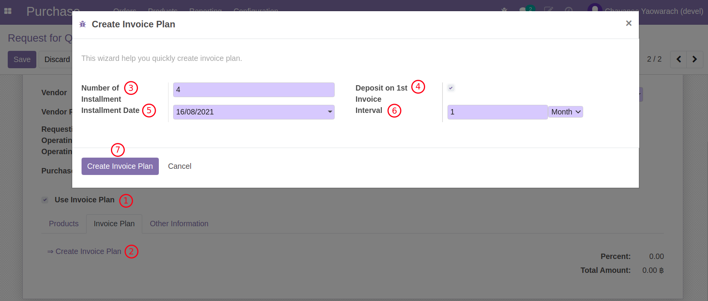

2. ปรับรายละเอียดตาราง Invoice Plan
      1. Installment 0 คือ Deposit
      2. ใส่ Percent หรือ Amount (ซึ่งจะคำนวณกลับเป็น %)
      3. กดปุ่ม Create Invoice เพื่อสร้าง Deposit Invoice
      

    !!! Note
          - การสร้าง Deposit Invoice จะเป็นใบแจ้งหนี้แรกที่ถูกสร้าง และสามารถทำได้โดยที่ยังไม่มีการตรวจรับ
          - ถ้าผู้ใช้พยายามสร้าง Bill อื่นก่อนที่จะสร้าง Deposit Invoice ระบบจะไม่อนุญาต

End.