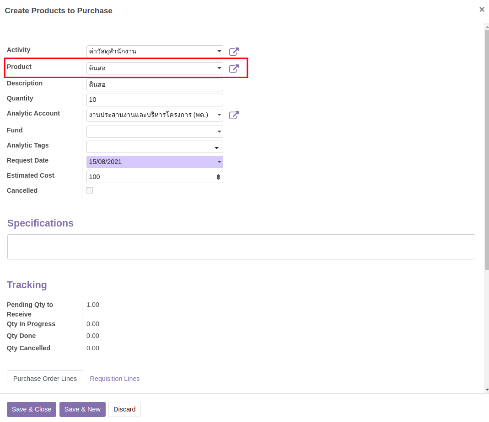
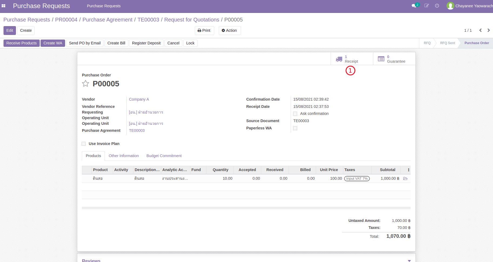
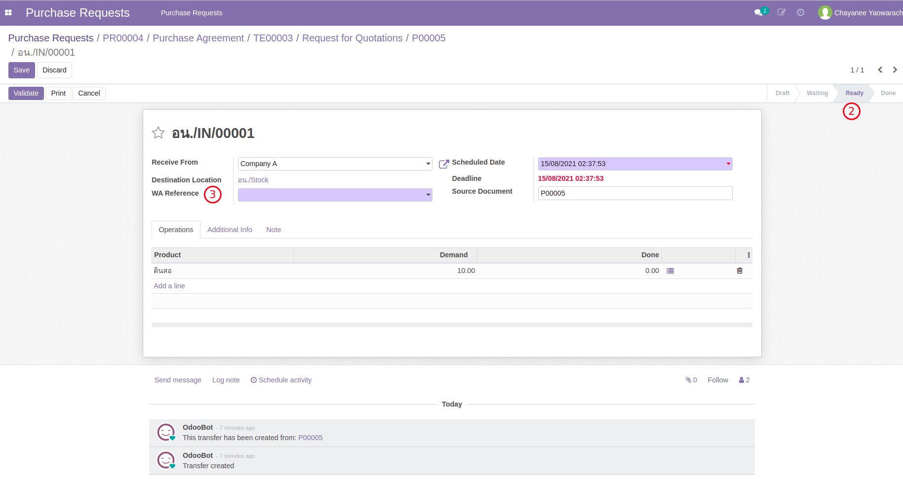
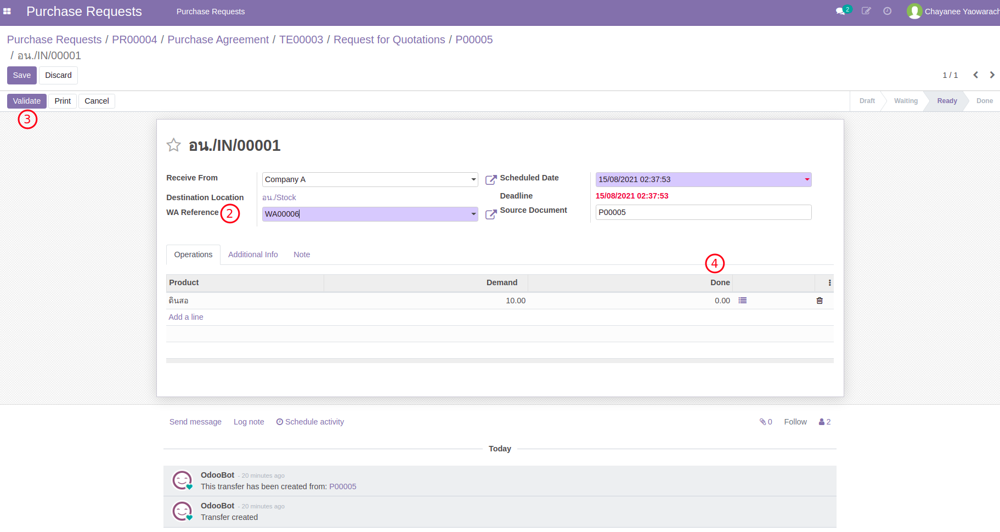
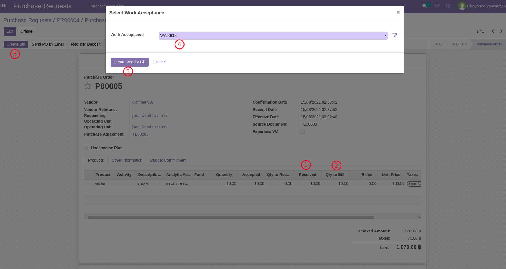

# กระบวนการจัดซื้อจัดจ้าง (กรณีมีรับวัสดุ)

กรณีซื้อวัสดุสำนักงาน จะมีขั้นตอนเกือบทั้งหมดเหมือนกับกรณีไม่ใช่วัสดุ แต่จะมีขั้นตอนเพิ่มเติมคือ

* **เพิ่มขั้นตอนระหว่างการสร้างเอกสาร PR โดยจะสามารถเลือกสินค้าที่ต้องการซื้อได้เลย**
* ดำเนินการสร้าง TE > RFQ > PO ตามปกติ
* ดำเนินการตรวจรับตามปกติ (WA)
* **เพิ่มขั้นตอนการรับสินค้าเข้าคลัง (IN) โดยอ้างอิงถึงการตรวจรับพัสดุ (WA)**
* ออกใบแจ้งหนี้ตามจำนวนสินค้าที่ได้รับ

**เอกสารนี้สำหรับ ::** เจ้าหน้าที่พัสดุ (Procurement Officer)

----------------------------------------------------------

## การสร้างใบขอซื้อจ้างสำหรับวัสดุสำนักงาน (Purchase Request:PR)

**Menu ::** Purchase Requests > Purchase Requests > Purchase Requests

1. สร้างเอกสาร PR ตามปกติ โดยมีความแตกต่างจาก[การสร้างใบขอซื้อจ้าง PR](../1_purchase_request/pr3_for_employee.md#purchase-requestpr)โดยทั่วไปดังต่อไปนี้
    1. เลือกวัสดุที่ต้องการซื้อ
    

2. หลังจากนี้เอกสาร PR จะเข้ากระบวนการตรวจสอบจากพัสดุ และเข้ารับการอนุมัติวงเงินจนสถานะเปลี่ยนเป็น Approved

End.

----------------------------------------------------------

## ดำเนินการสร้าง TE > RFQ > PO > WA

**Menu ::** Purchase > Orders > Purchase Orders

!!! Note
    ขั้นตอนนี้เริ่มต้นหลังจากได้ Purchase Order ที่ Approved แล้ว (state = Purchase Order)
      
    Ref: [สร้างเอกสารการเสนอราคา Purchase Agreement/TE จาก PR](po3_for_procurement_officer.md)

1. ตรวจทานเอกสาร Purchase Order ที่ได้รับการอนุมัติแล้ว
    1. เนื่องจากจาก Product เป็นวัสดุสำนักงานที่ต้องรับเข้าคลัง **ระบบจะสร้างใบรับสินค้า Receipt ไว้ให้ล่วงหน้า**
    
    2. เจ้าหน้าที่พัสดุจะสามารถคลิกที่ icon Receipt เพิ่มเข้าไปดูเอกสารรับวัสดุเข้าคลังโดยเอกสารมีสถานะ Ready
    3. เอกสารต้องอ้างถึงเอกสารการตรวจรับ WA ที่ผ่านการอนุมัติแล้ว จึงจะสามารถรับวัสดุเข้าคลังได้
    
2. [สร้างเอกสารตรวจรับวัสดุ WA จาก PO ตามขั้นตอนปกติ](po3_for_procurement_officer.md#wa-po)

End.

----------------------------------------------------------

## รับวัสดุเข้าคลัง (Receipt) และใบแจ้งหนี้ (Vendor Bill) ตามผลการตรวจรับ (WA) 

!!! Note
    ขั้นตอนนี้เกิดขึ้นหลังจากได้ทำการตรวจรับสินค้า WA เป็นที่เรียบร้อยแล้ว

**Menu ::** Purchase > Orders > Purchase Orders

1. ที่เอกสาร Purchase Order หลังจากได้ทำเอกสารตรวจรับ WA เป็นที่เรียบร้อยแล้ว มีข้อมูลที่น่าสนใจดังนี้
    1. WA ถูกสร้างและอนุมัติแล้ว
    2. Receipt (IN) พร้อมสำหรับการรับวัสดุ
    3. Quantity: จำนวนที่สั่งซื้อ
    4. Accepted: จำนวนที่ผ่านการตรวจรับโดย WA
    5. Qty to Receive: จำนวนที่ระบบเตรียมรับ
    6. Received: จำนวนที่รับเข้าคลังแล้ว
    

    !!! Note
        จากรูปตัวอย่างจะเห็นว่า การตรวจรับได้ทำครบแล้ว (Qty=10) แต่ยังไม่ได้รับเข้าคลัง (Qty=0)

2. ดำเนินการรับของเข้าคลัง (Receipt IN)
    1. จากหน้าต่าง Purchase Order กดปุ่ม Receipt Product (หรือคลิกที่ icon Receipt)
    2. ที่เอกสาร Receipt ให้เลือกเอกสาร WA ที่ได้ทำการตรวจรับไปก่อนหน้า
    3. กดปุ่ม Validate ระบบจะทำการรับของเข้าคลังตามจำนวนใน WA
    4. จำนวนการรับจะเท่ากับจำนวนที่ได้ตรวจรับใน WA และสถานะเอกสารเปลี่ยนเป็น Done
    

3. สร้างเอกสารใบแจ้งหนี้ Vendor Bill (draft)
    1. กลับมาที่หน้าต่าง Purchase Order จะเห็นว่ามีจำนวนรับวัสดุแล้ว (Received)
    2. แต่จำนวนที่ต้องแจ้งหนี้ (Qty to Bill) ยังคงอยู่ (จำนวนแจ้งหนี้แล้ว Billed = 0.0)
    3. กดปุ่ม Create Bill เพื่อสร้างใบแจ้งหนี้ ระบบจะเปิด Wizard
    4. ที่ Wizard ให้เลือก WA ที่ตรวจรับแล้วแต่ยังไม่ออกใบแจ้งหนี้
    5. กดปุ่ม Create Vendor Bill เพื่อสร้างใบแจ้งหนี้
    6. หลังจากสร้างใบแจ้งหนี้แล้วที่หน้าต่าง Purchase Order จะมีปุ่มกดเพื่อเชื่อมไปยัง Vendor Bills ที่เพิ่งถูกสร้างขึ้น
    
    

End.