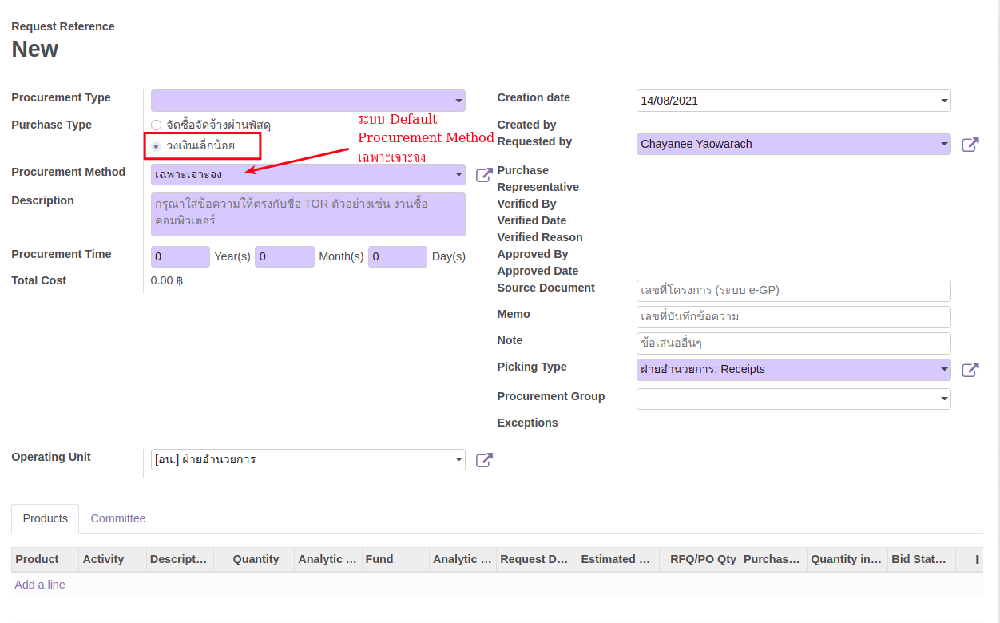

# กระบวนการจัดซื้อจัดจ้างประเภทวงเงินเล็กน้อย

**เอกสารนี้สำหรับ ::** ผู้ขอจัดซื้อจัดจ้าง (Employee) และ เจ้าหน้าที่พัสดุ (Procurement Officer)

การจัดซื้อจัดจ้างประเภทวงเงินเล็กน้อย คือ การจัดซื้อจัดจ้างที่ไม่เกิน 100,000 บาท ซึ่งผู้ขอจัดซื้อจัดจ้างจะ Request PR โดยเลือก Purchase Type วงเงินเล็กน้อย ถัดจากนั้นจะเข้าสู่กระบวนการจัดซื้อจัดจ้างปกติผ่านเจ้าหน้าที่พัสดุ (TE > RFQ > PO > WA)

!!! Note
    ศึกษาเพิ่มเติมได้ที่
     
    - [การสร้าง Purchase Request โดยพนักงาน](../1_purchase_request/pr3_for_employee.md)
     
    - [การจัดซื้อจัดจ้างโดยเจ้าหน้าที่พัสดุ](po3_for_procurement_officer.md)