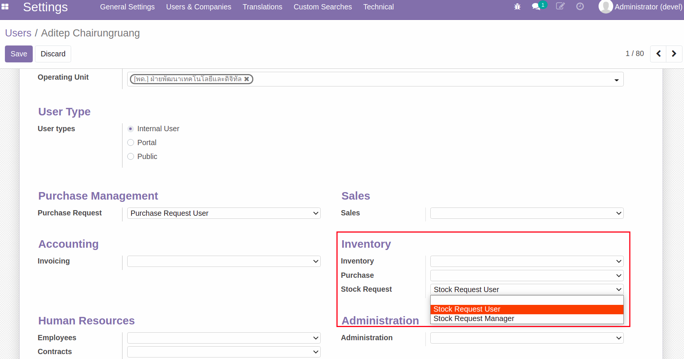
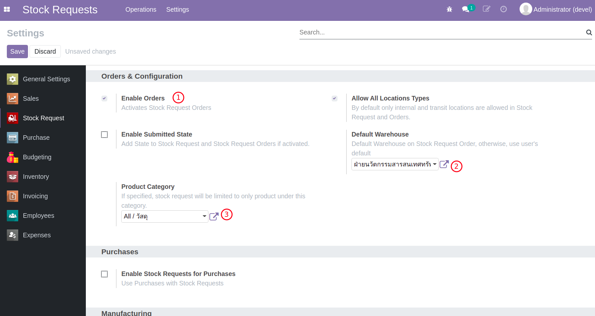

# กระบวนการเบิกวัสดุคงคลัง (Stock Request)

**เอกสารนี้สำหรับ ::** ผู้ดูแลระบบ (System Administrator)

1. การตั้งค่าสิทธิ์สำหรับผู้ใช้งาน
2. การตั้งค่าโมดูล Stock Request
3. การตั้งค่าวัสดุ Products

## 1. การตั้งค่าสิทธิ์สำหรับผู้ใช้งาน

**Menu ::** Settings > Users & Companies > Users

- สำหรับผู้ขอเบิกวัสดุ ต้องมีสิทธิ์เป็น Stock Request User
- สำหรับผู้ดูแลการขอเบิก ต้องมีสิทธิ์เป็น Stock Request Manager และ Inventory Administrator

    
    
     

## 2. การตั้งค่าโมดูล Stock Request

**Menu ::** Stock Requests > Settings

1. Enable Order: เลือกใช้ เพื่อเปิดใช้งาน Stock Request Order
2. Default Warehouse: คลังที่ใช้เป็นค่าเริ่มต้นตอนสร้าง Stock Request Order
3. Product Category: กำหนดกลุ่มสินค้า (กลุ่มใหญ่ซึ่งจะรวมกลุ่มย่อยๆด้วย) ที่จะเปิดให้เลือกในหน้าต่างของโมดูล Stock Request

    
    
     

## 3. การตั้งค่าวัสดุ Products

**Menu ::** Inventory > Products > Products

ตั้งค่าเหล่านี้สำหรับวัสดุสำหรับการเบิก

1. Can be Purchased: เลือกเพื่อให้สามารถจัดซื้อได้
2. Product Type: Storable สินค้าจัดเก็บในคลัง
3. Product Category: เลือกกลุ่มหรือกลุ่มย่อยภายใต้ Product Category ในขั้นตอนก่อนหน้า

    

    
