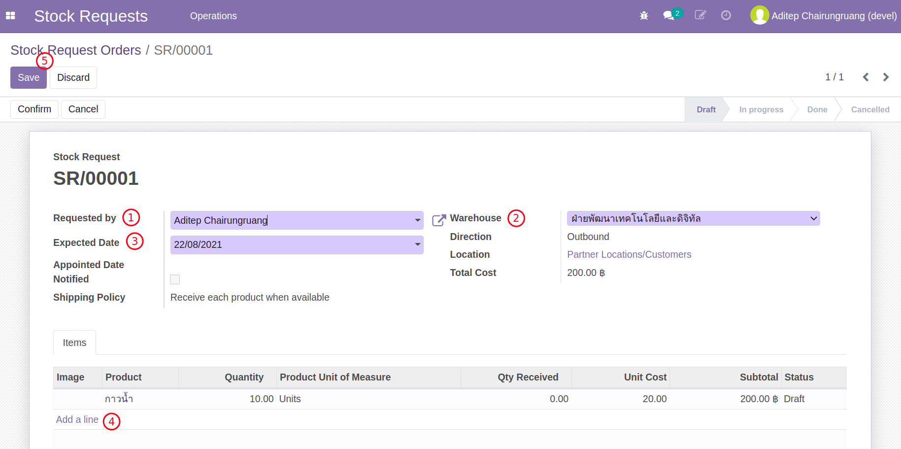
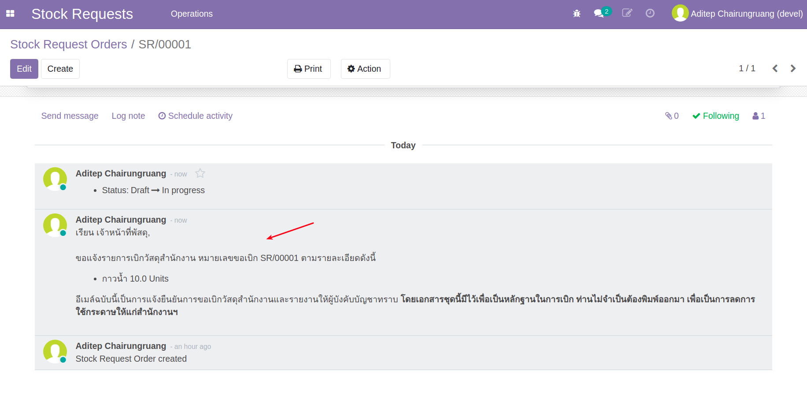
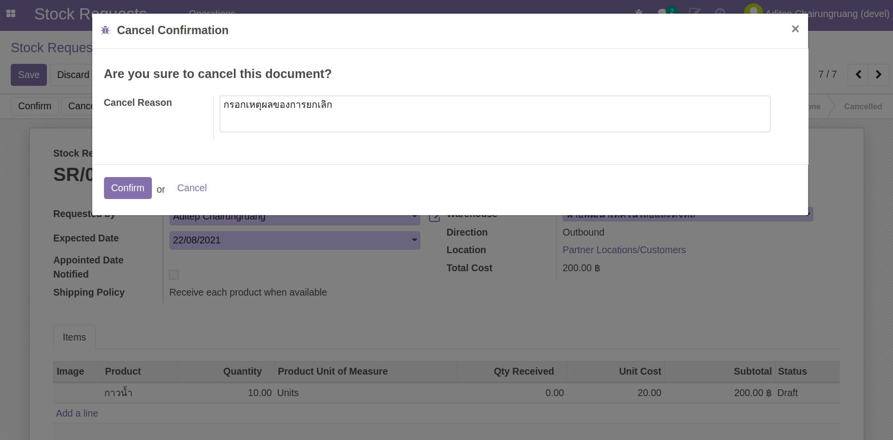

# กระบวนการเบิกวัสดุคงคลัง (Stock Request)

**เอกสารนี้สำหรับ ::** ผู้ขอเบิก (Stock Request User)

## การสร้างใบขอเบิกวัสดุ

!!! Tip "สำหรับ Use Cases"
    * (1) ขอเบิกวัสดุและเบิกได้ทั้งหมด
    * (2) ขอเบิกวัสดุแต่เบิกได้บางส่วน
    * (3) ขอเบิกวัสดุแต่ถูกยกเลิกโดยฝ่ายพัสดุ

**Menu ::** Stock Requests > Operations > Stock Request Orders

1. กดปุ่ม Create เพื่อสร้าง Stock Request Order ใหม่
      1.  Requested by: ผู้ขอ โดยเป็นชื่อเดียวกับผู้ login แต่เปลี่ยนได้กรณีทำแทนกัน
      2.  Warehouse: คลังที่ขอเบิก
      3.  Expected Date: วันที่ต้องการ (ใส่ไว้เป็นข้อมูลให้กับฝ่ายพัสดุ)
      4.  Add a line: เพิ่ม product ที่ต้องการเบิก
      5.  Save

    
    
     

2. กดปุ่ม Confirm เพื่อยื่นคำขอ
3. ระบบจะส่ง email เพื่อแจ้งการขอไปยัง 1) ผู้ขอ 2) หัวหน้าผู้ขอ 3) ฝ่ายพัสดุ
4. เนื้อหา email จะมีการแนบไว้ที่ส่วนล่างของเอกสาร

    
    
     

End.

---------------------------------------------

## การสร้างใบขอเบิกวัสดุและยกเลิกทันที

!!! Tip "สำหรับ Use Cases"
    * (4) ขอเบิกวัสดุและยกเลิก

**Menu ::** Stock Requests > Operations > Stock Request Orders

1. กดปุ่ม Create เพื่อสร้าง Stock Request Order ใหม่
2. ในขณะที่ Status เอกสารยังเป็น Draft สามารถกดปุ่ม Cancel เพื่อยกเลิกเอกสารพร้อมเหตุผลการยกเลิก

    

!!! Note
    ผู้ขอสามารถยกเลิกเอกสารได้เมื่อเอกสารยังไม่ได้ยืนยันเท่านั้น หลักจากยืนยันเอกสารไปแล้วจะอยู่ที่ฝ่ายพัสดุในการยกเลิก
