# กระบวนการเบิกวัสดุคงคลัง (Stock Request)

**เอกสารนี้สำหรับ ::** ผู้ดูแลคลังวัสดุ (Stock Request Manager)

## นัดหมายรับวัสดุ

!!! Tip "สำหรับ Use Cases"
    * (1) ขอเบิกวัสดุและเบิกได้ทั้งหมด
    * (2) ขอเบิกวัสดุแต่เบิกได้บางส่วน

**Menu ::** Stock Requests > Operations > Stock Request Orders

เมื่อมีการขอวัสดุเข้ามาทางที่ฝ่ายพัสดุ Stock Request Manager
จึงเข้ามาที่ระบบเพื่อตรวจสอบและดำเนินการนัดหมายการรับวัสดุต่อไป

1. Stock Request Manager จะเห็นเอกสารของทุกคนในระบบตามสถานะต่างๆดังรูป

    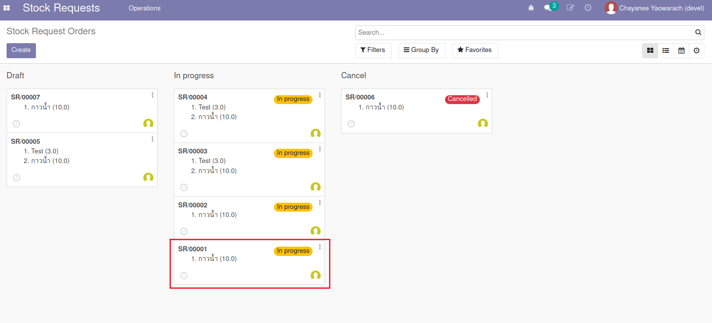
    
     

2. เปิดเอกสารที่ต้องการทำงาน และกดปุ่ม Edit เพื่อแก้ไข
      1. Appointed Date: เลือกวันที่ต้องการให้มารับวัสดุ
      2. กดปุ่ม Notify Appointment ระบบจะเปิด Wizard ที่มีข้อความแจังวันนัดรับวัสดุแก่ผู้ขอ (แก้ข้อความเพิ่มเติมได้)
      3. Smart Button แสดงให้เห็นว่ามีระบบได้มีการเตรียมการ Transfer ไว้แล้ว

    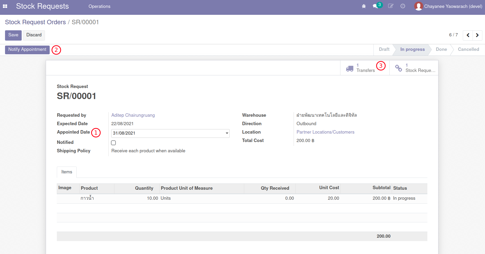
    
     

3. ที่ Email Wizard
      1. ระบบได้เตรียมร่าง email ตาม Template: Make Appointment
      2. ระบบแนบฟอร์มใบขอเบิกวัสดุเป็น PDF ไว้กับ email
      3. กดปุ่ม Send เพื่อส่ง email ไปยังผู้ขอเบิก

    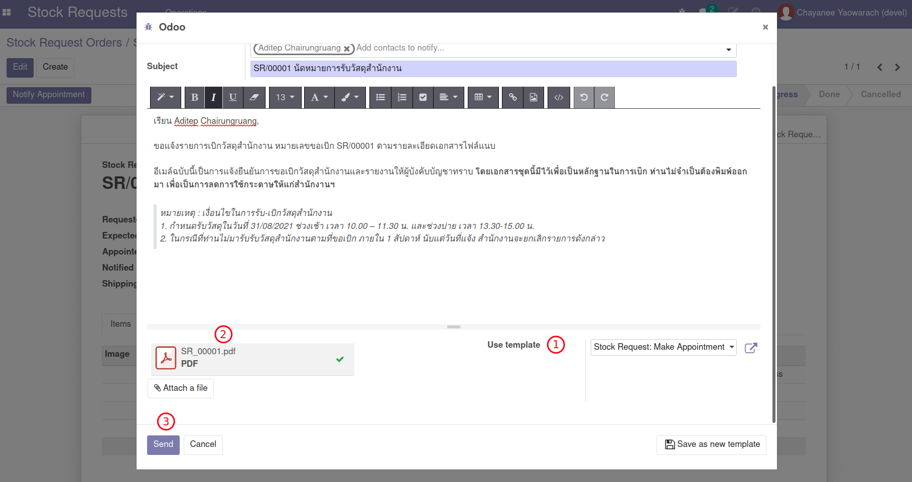
    
     

4. เนื้อหา email จะมีการแนบไว้ที่ส่วนล่างของเอกสาร

    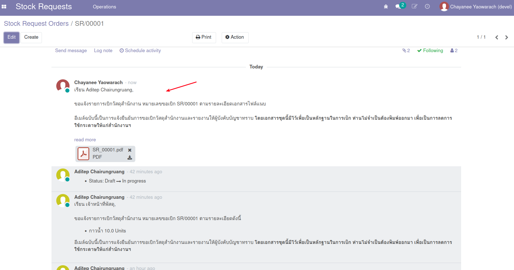

    
    
     

End.

---------------------------------------------

## จำหน่ายวัสดุทั้งหมด

!!! Tip "สำหรับ Use Cases"
    * (1) ขอเบิกวัสดุและเบิกได้ทั้งหมด

**Menu ::** Stock Requests > Operations > Stock Request Orders

เมื่อถึงวันนัดรับวัสดุ Stock Request Manager ทำการจำหน่ายวัสดุออกจากระบบ (Transfer Out)

1. ค้นหาและเปิดเอกสารตามเลขที่ที่ต้องการและคลิกไปที่ Smart Button เพื่อเปิดเอกสาร Transfers ที่ระบบสร้างรอไว้
2. ที่หน้าต่าง Transfer ทำการเช็คจำนวนที่มีในคลัง
      1. Tab Operations: แสดงรายการที่ต้องการเบิก โดยระบบจะแสดงสถานะความพร้อม
      2. กดปุ่ม Check Avalilability เพื่อจองรายการเบิก (ตามยอด On Hand)
      3. Tab Detailed Operations: แสดงรายการจองที่พร้อมจำหน่าย

    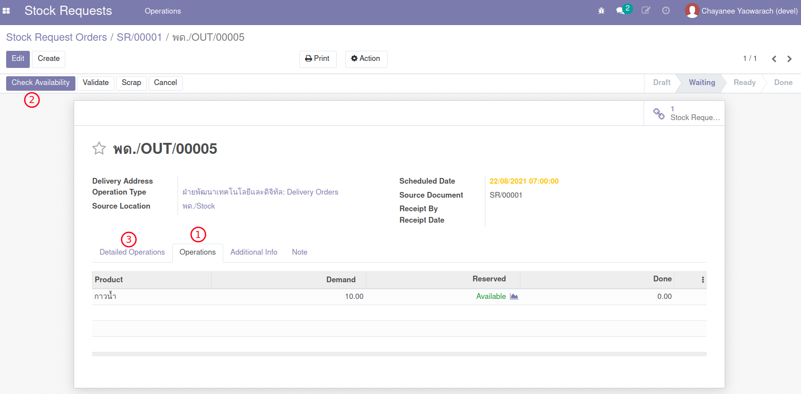
    
     

3. กรอกชื่อผู้ที่เข้ามารับวัสดุจริง Receipt By (ไม่จำเป็นต้องเป็นคนเดียวกับผู้ขอเบิก) และวันที่รับวัสดุ Receipt Date
4. สำหรับกรณีที่ต้องการจำหน่ายวัสดุตามจำนวนที่ขอเบิก ไม่จำเป็นต้องกรอกยืนยันจำนวน Done Quantity สามารถกดปุ่ม Validate ตามด้วย Apply ได้ทันที (ระบบจะ Transfer ทั้งหมดตามจำนวนที่มี)

    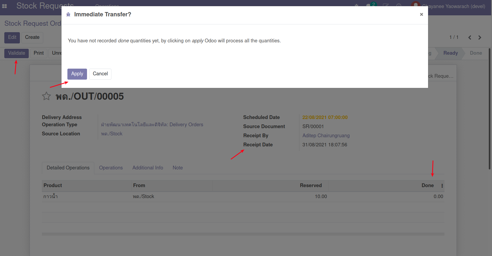
    
     

5. ระบบจะส่ง email ไปยัง 1) ผู้ขอเบิก 2) ผู้ัรับเบิก
6. เนื้อหา email จะมีการแนบไว้ที่ส่วนล่างของเอกสาร

    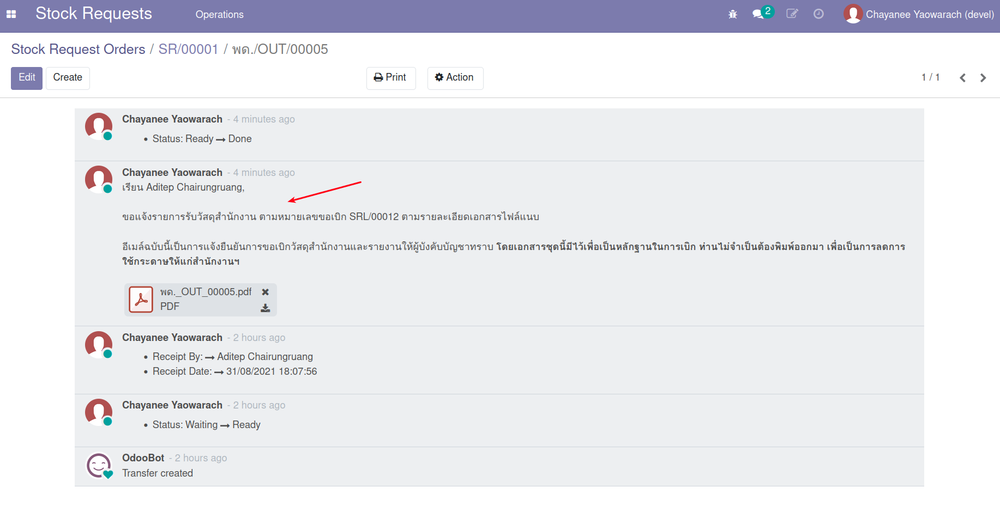

    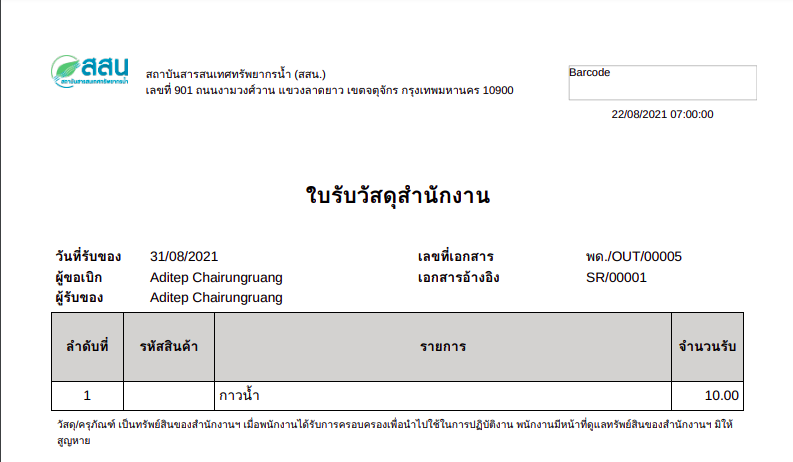
    
     

End.

---------------------------------------------

## จำหน่ายวัสดุเป็นบางส่วน

!!! Tip "สำหรับ Use Cases"
    * (2) ขอเบิกวัสดุแต่เบิกได้บางส่วน

**Menu ::** Stock Requests > Operations > Stock Request Orders

เมื่อถึงวันที่นัดหมายให้มารับวัสดุ Stock Request Manager จะทำการจำหน่ายวัสดุให้ผู้รับเบิก และเข้ามาที่ระบบเพื่อจำหน่ายวัสดุออกจากระบบ (Transfer)

1. ค้นหาและเปิดเอกสารตามเลขที่ที่ต้องการและคลิกไปที่ Smart Button เพื่อเปิด Transfers ที่ระบบสร้างไว้
2. ที่หน้าต่าง Transfer กดปุ่ม Check Avalilability เพื่อจองวัสดุ
3. กรอกชื่อผู้รับ Receipt By (ไม่จำเป็นต้องเป็นคนเดียวกับผู้ขอเบิก) และวันที่รับวัสดุ Receipt Date
4. สำหรับกรณีที่ต้องการจำหน่ายวัสดุเป็นบางส่วน
      1. ให้ใส่จำนวนที่เบิกได้ที่ช่อง Done Quantity
      2. กดปุ่ม Validate ระบบจะถามว่าจะสร้าง Back Order หรือไม่ให้กดปุ่ม No Backorder

    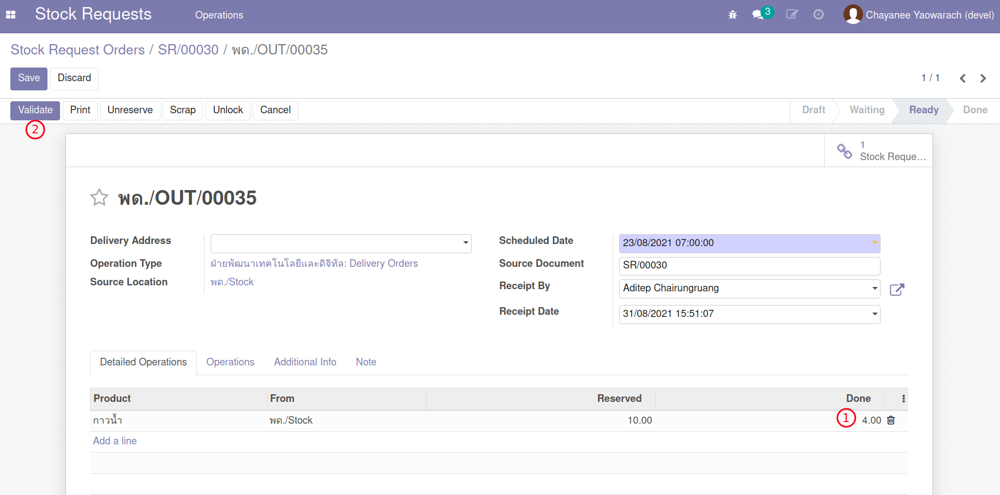
    
    !!! Note
        กรณีนี้เรากดปุ่มไม่สร้าง Backorder เพราะต้องการจำหน่ายวัสดุเพียงบางส่วน
        เมื่อกลับไปดูที่หน้าต่าง Stock Request Order จะเห็นสถานะเปลี่ยนเป็น Done ทันที
        
        แต่ถ้ากดปุ่ม Create Backorder ระบบจะสร้าง Transfer สำหรับจำหน่ายจำนวนที่เหลือได้ในอนาคต

5. ระบบจะส่ง email ไปยัง 1) ผู้ขอเบิก 2) ผู้ัรับเบิก ด้วยจำนวนเท่าที่ได้รับจริง
6. เนื้อหา email จะมีการแนบไว้ที่ส่วนล่างของเอกสาร  

    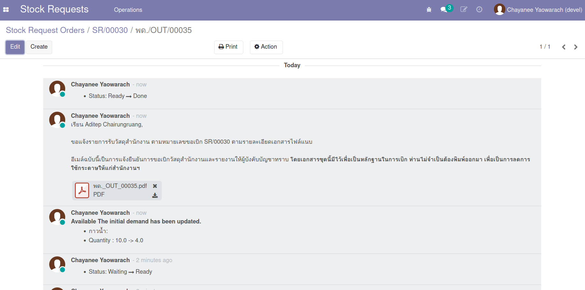

    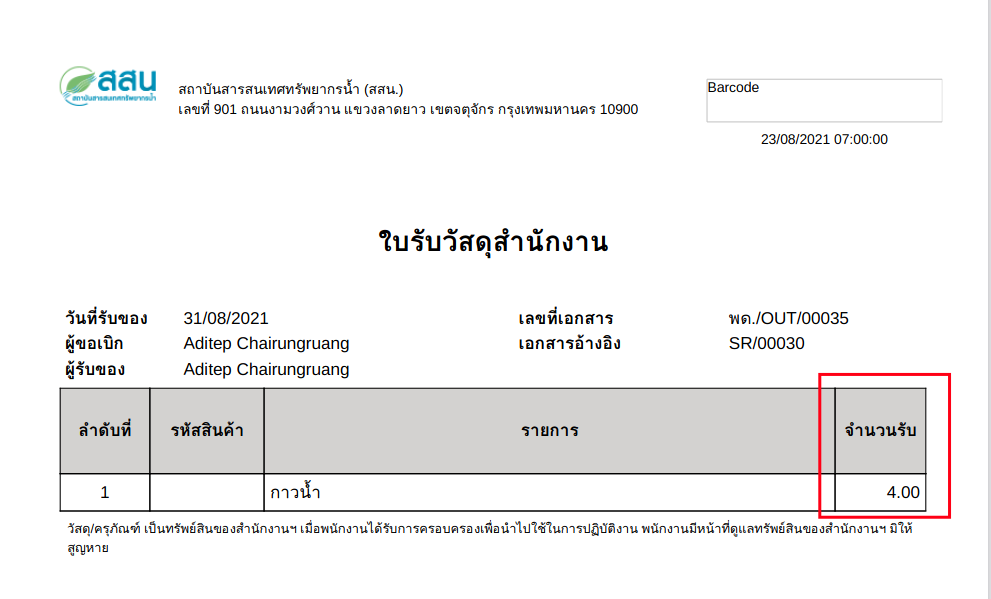
    
     

7. กลับไปที่เอกสาร Stock Request Order จะเห็นได้ว่า
      1. สถานะเปลี่ยนเป็น Done
      2. จำนวนรับ Qty Received เท่ากับจำนวนจำหน่ายบางส่วน

    
    
     

End.

---------------------------------------------

## แจ้งยกเลิกการรับวัสดุ

!!! Tip "สำหรับ Use Cases"
    * (3) ขอเบิกวัสดุแต่ถูกยกเลิกโดยฝ่ายพัสดุ

**Menu ::** Stock Requests > Operations > Stock Request Orders

เมื่อมีการขอวัสดุสำนักงาน Stock Request Manager จะได้รับ email คำขอ

1. เปิดเอกสารที่ต้องการทำงาน และกดปุ่ม Edit เพื่อกรอกข้อมูลเช่นเดียวกับการนัดรับวัสดุ
2. กดปุ่ม Notify ระบบจะเปิด Wizard ที่มีข้อความการแจ้งเตือนผู้รับ
3. ให้ทำการเปลี่ยน Template เป็น Cancel Appointment ตามรูป

    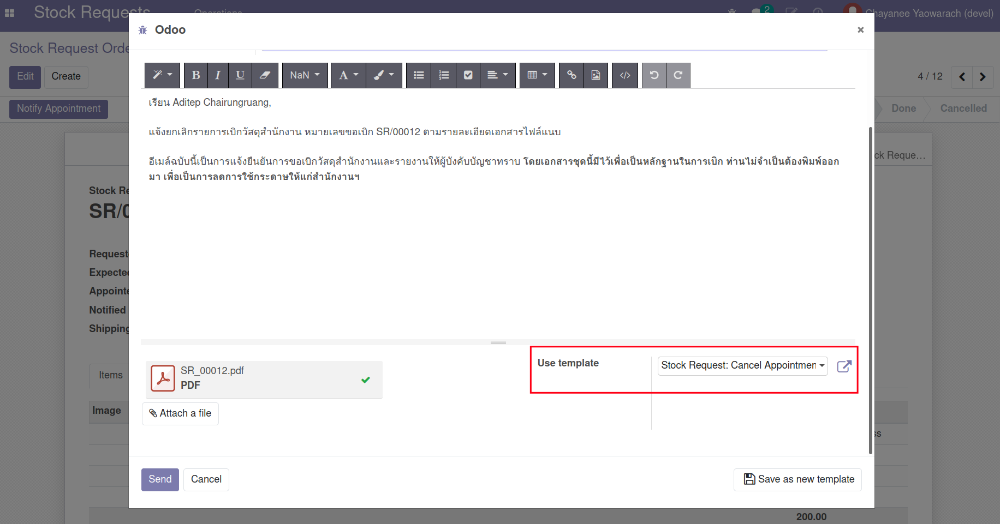
    
     

4. กดปุ่ม Send เพื่อส่ง email สำหรับการยกเลิก
5. คลิก Smart Button เพื่อเปิด Transfers ที่ระบบสร้างไว้
6. ที่หน้าต่าง Transfer กดปุ่ม Cancel พร้อมกรอกเหตุผล

    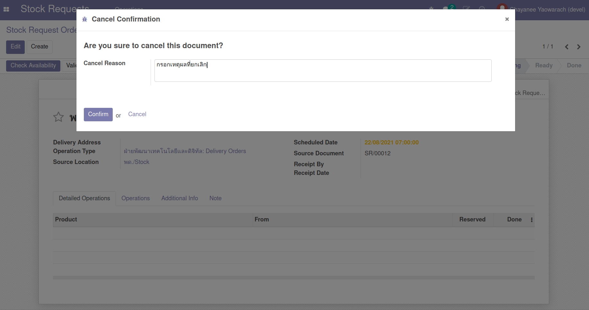
    
     

7. กลับไปที่เอกสาร Stock Request Order จะเห็นได้ว่า
      1. สถานะเปลี่ยนเป็น Done
      2. จำนวนรับ Qty Received เท่ากับ 0

End.

---------------------------------------------

## สร้าง Inventory Adjustment

!!! Tip "สำหรับ Use Cases"
    * (5) การนับสินค้าและปรับยอดจำนวนวัสดุในคลัง

**Menu ::** Inventory > Operations > Inventory Adjustments

1. กดปุ่ม Create เพื่อสร้าง Inventory Adjustment ใหม่
      - Inventory Reference: ตั้งชื่อการปรับปรุงสินค้า เช่น "นับสินค้า วันที่ xx/xx/xxxx"
      - Locations: เลือก location เช่น พด./Stock
      - Products: เลือกวัสดุเท่าที่ต้องการนับ หรือปล่อยว่างเพื่อนับทุกวัสดุ
      - Include Exhausted Product: เลือกใช้ หากรวมถึงวัสดุที่ปัจจุบันอาจมีจำนวนเท่ากับศูนย์
      - Accounting Date: วันที่บันทึกบัญชีหรือปล่อยว่างเพื่อใช้วันที่ปัจจุบัน
      - Counted Quantities:
        - Default to stock on hand: ต้องการให้แสดงจำนวนปัจจุบันก่อนเสมอ
        - Default to zero: ไม่ต้องการแสดงจำนวนปัจจุบัน (แสดงค่าเป็น 0)

    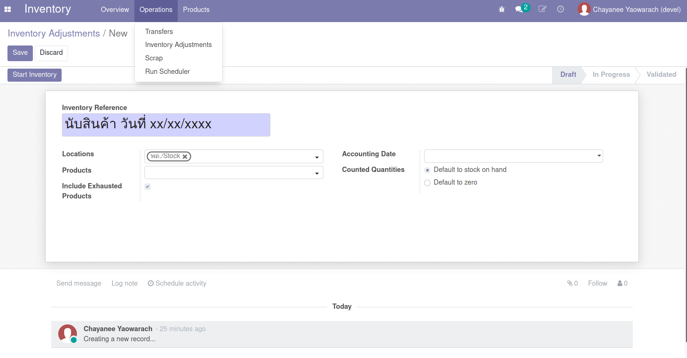
    
     
    
2. ใส่จำนวนที่นับได้จริงของแต่ละวัสดุที่ช่อง Counted

    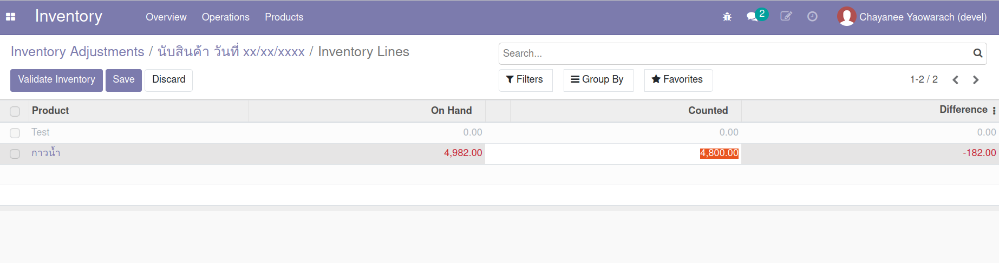
    
     

3. กดปุ่ม Validate Inventory ระบบจะทำการปรับยอดคงเหลือของแต่ละวัสดุใหม่

End.

---------------------------------------------

## ดูรายงานที่เกี่ยวข้องกับคลังวัสดุ

!!! Tip "สำหรับ Use Cases"
    * (6) รายงานที่เกี่ยวข้องกับคลังวัสดุ

1. Stock Card
2. Inventory Report
3. Forecasted Inventory
4. Inventory Valuation

!!! Note
    รายงานด้านคลังสินค้าใช้หลักการ Double Entry นั่นหมายถึง

    * Onhand Quantity = Actual In Qty - Actual Out Qty
    * Future Quantity = Onhand Quantity - Reserved Quantity
    * Reserved Quantity = Planned Out Qty - Planned In Qty

### Stock Card

**Menu ::** Inventory > Reporting > Stock Card

รายงานนี้ใช้สำหรับดูรายการเข้าออกจาก Location ของสินค้าตัวหนึ่ง ในช่วงเวลาหนึ่ง
โดยผู้ใช้งานจะใส่ค่าการค้นหาตามต้องการก่อนดูรายงาน

1. Period / Start Date / End Date: ช่วงเวลาที่สนใจ
2. Products: วัสดุที่สนใจ
3. Location: สถานที่จัดเก็บ
4. สามารถออกรายงานได้ทั้งแบบ 1. View 2. PDF 3. Excel

    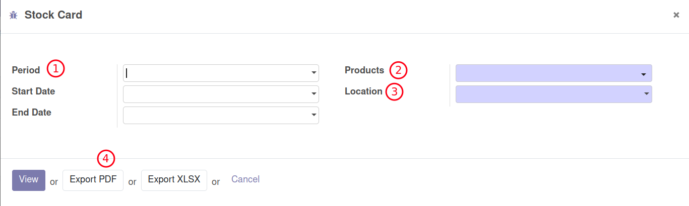

    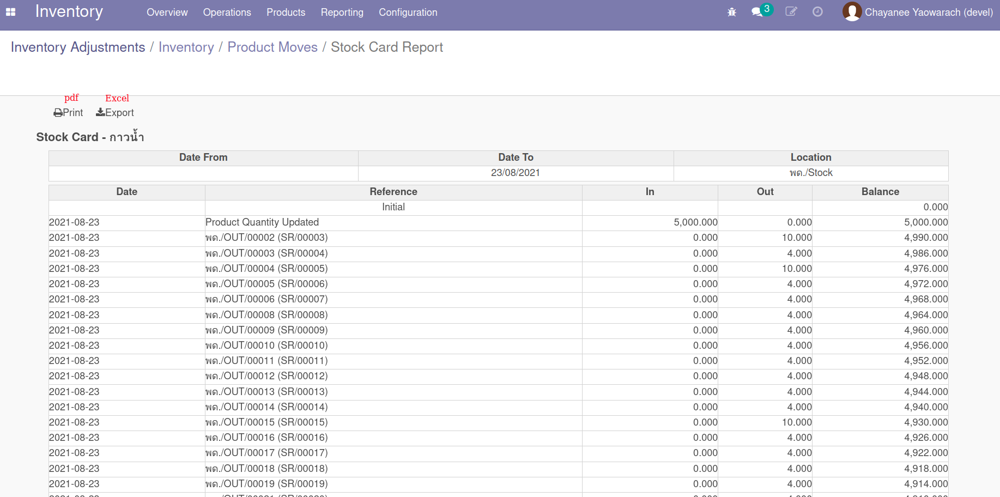

### Inventory Report

**Menu ::** Inventory > Reporting > Inventory Report

รายงานนี้ใช้สำหรับดูข้อมูลมูลค่าของในคลัง ณ เวลาใดเวลาหนึ่ง โดยรายงานจะมี

1. กำหนดวันที่ต้องการดูมูลค่าของในคลัง (อดีตหรือปัจจบัน)
2. สามารถค้นหาข้อมูล (Filter) บิดรายงานตามมุมมองที่ต้องการ (Group By) และดูรายงานได้หลายรูปแบบ (Views)

    

    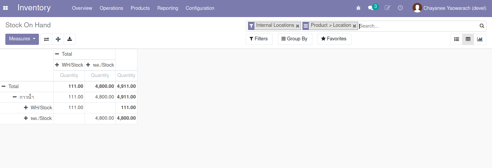

    

### Forecasted Inventory

**Menu ::** Inventory > Reporting > Forecasted Inventory

รายงานนี้เน้นไปที่การมองความต้องการในอนาคต Future Quantity โดยรวม Reserved Quantity (มีแผนใช้งาน) เข้ามาเป็นตัวแปรด้วย

1. รายงานสามารถค้นหาตามวัสดุ
2. ช่วงเวลาที่สนใจ
3. แสดงผลเป็นรูปกราฟ

    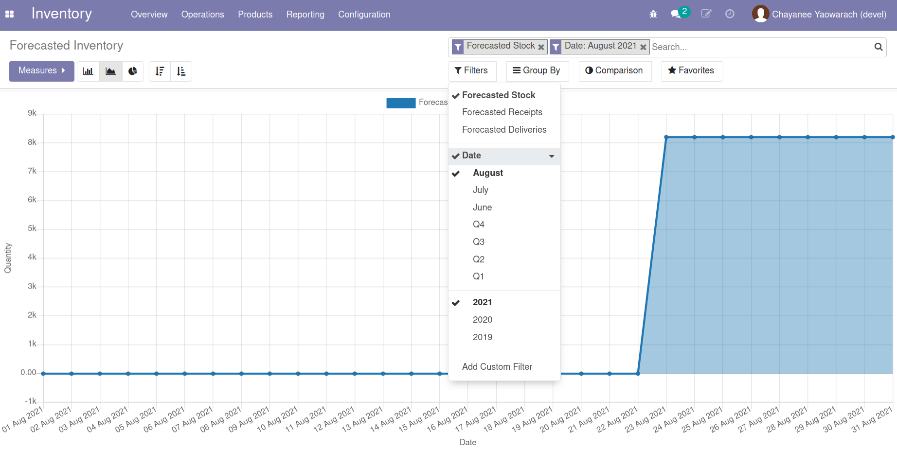

### Inventory Valuation

**Menu ::** Inventory > Reporting > Inventory Valuation

รายงานนี้เน้นไปที่การดูมูลค่าของสินค้าคงคลัง โดยสามารถดูย้อนประวัติของมูลค่าคลังสินค้าที่เกิดขึ้นในทุกๆ Transaction ตามมูลค่า (Cost) ในขณะนั้น

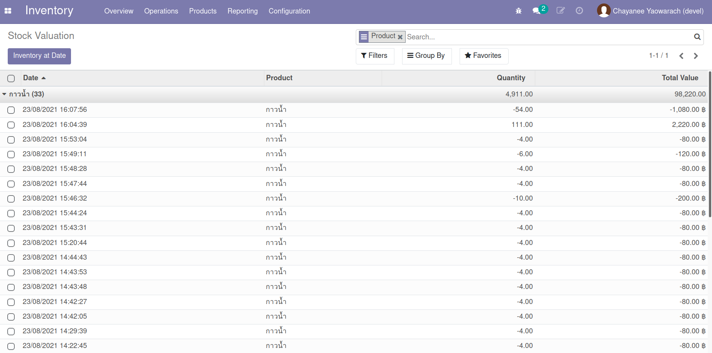

---------------------------------------------

## การใช้งานอื่นๆ

!!! Tip "สำหรับ Use Cases"
    * (7) การใช้งานอื่นๆ

หัวข้อนี้นำเสนอเรื่องอื่นที่อาจเป็นประโยชน์ต่อการใช้งาน

1. การดูวันกำหนดรับของ Stock Request ด้วยปฏิทิน
2. การดูภาพรวมของ Stock Request ทั้งหมด

**Menu ::** Stock Requests > Operations > Stock Request Orders

มุมมองปฏิทินสามารถช่วยให้ผู้จัดเตรียมวัสดุล่วงหน้าในอนาคตได้สะดวกขึ้น

1. หน้าต่างของ Stock Request Orders มีหลายมุมมอง ให้เลือกมุมมองแบบปฏิทิน
2. กรองเฉพาะผู้ขอที่ต้องการ
3. กรองสถานะของเอกสาร เช่น In Progress

    

หน้าต่างต่อไปนี้จะรวมรายการรายบรรทัดของ Stock Requests ของทุกๆ Stock Request Orders ทำให้สามารถดูดูมุมมองเชิงวิเคราะห์ของการเบิกสินค้าในภาพรวมได้อย่างอิสระ

**Menu ::** Stock Requests > Operations > Stock Requests

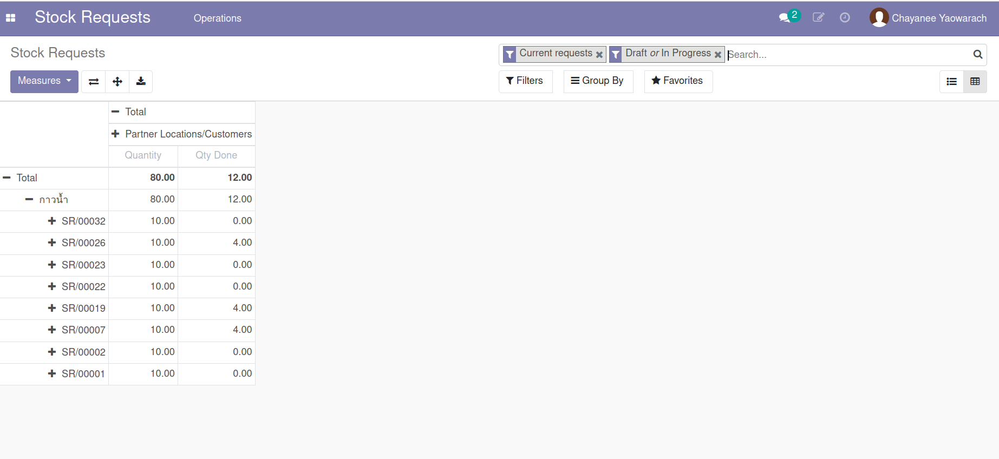
